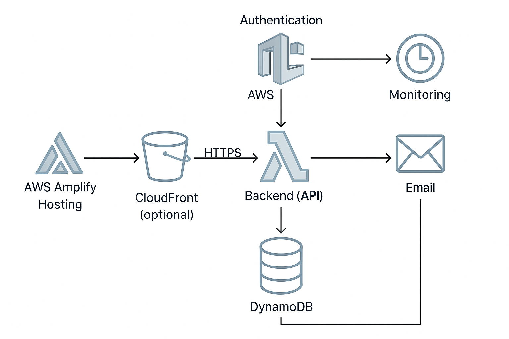

# Infra Tech Stack

## Authentication: AWS Cognito

- Easy to implement email and social auth
- Below 50k monthly active users, free tier

## Frontend: AWS Amplify Hosting

- Differently from Vercel/Netlify, you don't pay for each dev set, but for usage

### Another possibility: S3 + CloudFront

- Host built frontend in an S3 bucket
- CloudFront serves it globally with caching
- S3 + CloudFront might be more cost-effective at scale

## Backend (API Server)

- AWS Lambda, no need for EC2 to host the backend
- 1 million requests per month for free
- Pay based on number of requests
- API Gatweay is also free for less than 1 million requests per month
- Recently AWS released AWS Lambda function URLs, so we can invoke the Lambda without the API Gateway

## Database (DynamoDB)

- Free tier 25GB of storage
- Around 200 million requests per month

## Monitoring, Logging and Observability (CloudWatch)

- CloudWatch free tier: 10 custom metrics, 10 alarms, 5GB of log ingestion, etc

## Email (AWS SES)

- Free tier: 62K emails per month for free

# Infra Repo ide

```
repo-root/
├── amplify-frontend/         # React app (hosted via Amplify or S3+CloudFront)
│   ├── public/
│   ├── src/
│   │   ├── App.tsx
│   │   ├── index.tsx
│   │   ├── aws-exports.js    # Auto-generated by Amplify CLI
│   │   └── auth/
│   │       └── useAuth.ts    # Cognito integration
│   ├── package.json
│   └── vite.config.ts
│
├── backend-functions/        # AWS Lambda functions
│   ├── getUser.ts
│   ├── postData.ts
│   └── package.json
│
├── infrastructure/           # IaC with CDK (or use Terraform)
│   ├── cdk.json
│   ├── bin/
│   │   └── app.ts
│   └── lib/
│       └── stack.ts          # Cognito, Lambda, DynamoDB, API Gateway, S3, SES
│
├── shared/
│   └── types.ts              # Shared types between frontend/backend
│
├── README.md
└── .gitignore
```

# Infra Diagram



AWS Startups: https://aws.amazon.com/startups
AWS Credits: https://aws.amazon.com/startups/credits
