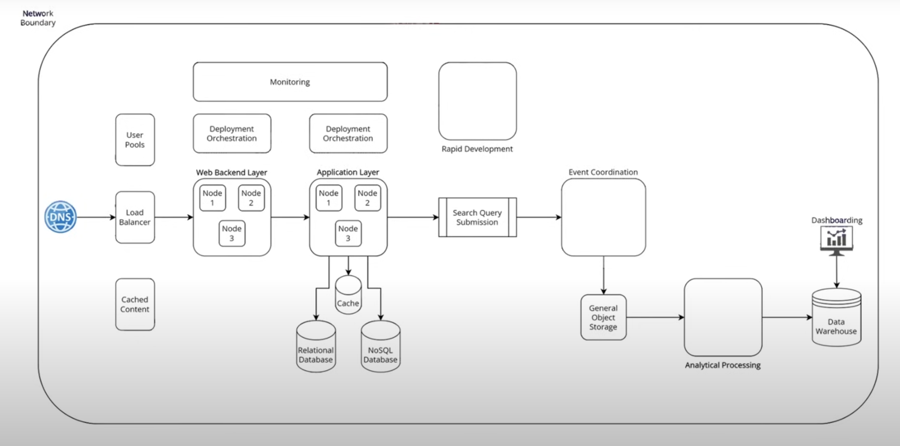

# AWS Services

## 1. Individual Services

### DNS: Route53

- Define DNS configuration
- Where you route traffic to
- Supports health-checking
- Defines externally facing apis/endpoints

### Load Balancer: Elastic Load Balancer

- Distributes traffic
- There are different strategies, either through the HTTP header or through the network layer

### Web Backend Layer: EC2 (Elastic Compute Cloud)

- EC2: Rent VMs for the hour
  - Pros:
    - Really flexible service
    - Host anything, from Wordpress to Backend
  - Cons:
    - Setup and config
    - Might not be the most cost-effective solution
- Lambda: Serverless compute infrastructure
  - Define functions that run on triggers
  - Abstract infrastructure
  - Pay-per-invocation
  - Really popular service
- ECS: Elastic Container Service
  - Used for Docker/containers
  - Helps manage containers
  - Something in the middle between EC2 and Lambda

### Application Layer

- Same fundamental building blocks as the backend layer (EC2, Lambda, ECS)

### API Gateway

- API throtlling
- Authorization
- Validates tokens
- Model validation for API requests

### User Pools (Cognito)

- Create user pools, meaning you can route users through it to create their profile
- Very useful for applications that require user registration

### Database

- Elastic Cache
  - Demands some infra node management
- Relational Database:
  - Aurora: in-house AWS db compatible with Postgres and MySQL
    - A bit more of "hands-off" db
    - What lambda did for EC2, Aurora does for RDS
  - RDS: Selects the db config you want
- NoSQL Database
  - DynamoDB: fully managed db
  - DocumentDB: Similar to MongoDB
  - OpenSearch: perform more complex queries and grouping

## 2. Packaged Services (PaaS - Platform-as-a-Service)

- They offer a combination of individual services

### 2.1 Elastic Beanstalk

- Packages multiple AWS services and lets you deploy and run web apps without managing infrastructure
- Like Vercel

#### 2.1.1 It offers

- Automatic provisioning of:
  - EC2
  - Load balancer
  - Auto scaling
  - RDS
  - CloudWatch
- Built-in deployment pipeline
- Environment management (dev, staging, prod)
- Supports multiple languages
- Zero-downtime deployments with rolling updates

| Feature       | Elastic Beanstalk                | Heroku                 | Vercel                      |
| ------------- | -------------------------------- | ---------------------- | --------------------------- |
| Infra control | Medium (AWS resources visible)   | Low (fully abstracted) | Very low (frontend-focused) |
| Focus         | Full-stack apps, backend heavy   | General web apps       | Frontend, edge/serverless   |
| Customization | High (we can tweak the services) | Low                    | Low                         |
| Pricing model | Pay-per-AWS resource             | Pay-per-dyno           | Pay-per function/storage    |
| Ease of use   | Moderate                         | Very easy              | Extremely easy              |

### 2.2. App Runner

- Fully managed PaaS for containerized web apps
- Just point to your repo/container image -> AWS builds & runs it
- Auto-scaling, HTTPS, load balancing, no infra config
- Closer to Vercel/Heroku, but with container support

### 2.3. Lightsail

- Simplified PaaS for small apps or quick prototypes
- Bundled pricing (VM, storage, networking)
- Offers pre-configured stacks (WordPress, LAMP, etc)
- Like a beginner-friendly verson of EC2 with PaaS flavor
- Good for simple applications, such as a blog
- Similar to GoDaddy, etc

### 2.4. Lambda + API Gateway

- Together act as a PaaS for serverless apps/APIs
- Fully abstracted runtime + autoscaling + event-driven triggers

### 2.5. Fargate

- Serverless containers
- Run Docker containers withotu managing EC2 instances
- More control than App Runner, still abstracts server provisioning
